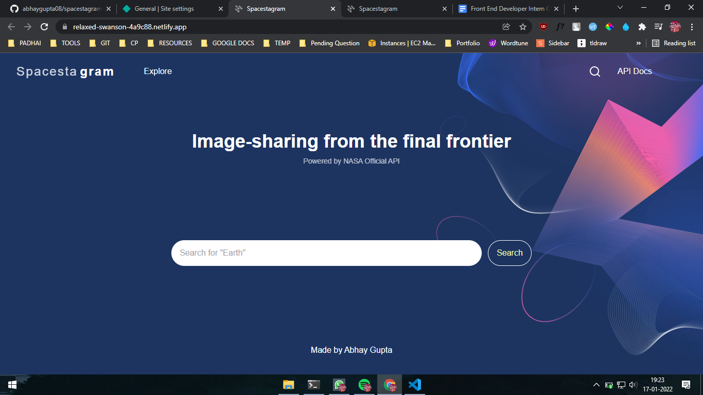

<div align='center'>
  <h1>Spacestagram</h1>

Image-sharing from the final frontier
 
 <a href='https://spacestagram-abhay.netlify.app/'>View Live Deploy</a> 
 <p>Made this under Shopify Challange</p>
 Created with 
 <br/>React | TailwindCSS | NasaAPI | Axois
  </div>
 
 ## Run this Web app on your local Machime 
 1. Download and Extract or Clone ```git clone https://github.com/abhaygupta08/spacestagram/``` this repository to your Local Machine.
 2. Go to the folder.
 3. Run ```npm i``` to install all the dependencies.
 4. Run ```npm start``` to start this project.
 5. Play with code 🧐
 
 
## The Challenge
We need a webpage that can pull images, and allow the user to “like” and “unlike” their favourite images.
1. We'd like a simple to use interface that makes it easy to:
2. Fetch data from one of NASA’s APIs and display the resulting images (more details under Technical Requirements)
3. Display descriptive data for each image (for example: title, date, description, etc.)
4. Like an image
5. Unlike an image
## Technical requirements
1. Search results should come from NASA’s free APIs, for which you’ll need a free API key from [https://api.nasa.gov](https://api.nasa.gov)
2. Each image result should list at least a title, date of capture (ideally in earth_date) and a button to “like” that image.
3. Each image can be “liked”, and a user should be able to undo their “like”
4. The HTML that ends up being served client-side should be accessible and semantic [https://developer.mozilla.org/en-US/docs/Learn/Accessibility/HTML](MDN reference)

## Extras
1. Save likes if the user leaves or reloads the page
2. Add a loading state while we wait for NASA’s API to return data
3. Create shareable links for each image
